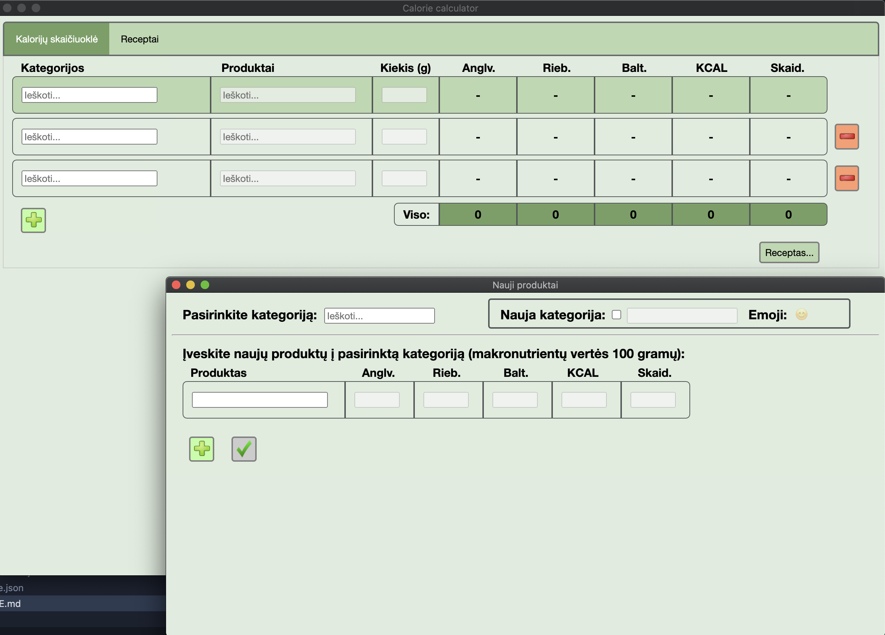

# Calorie calculator (Lithuanian)

## About
Electron-written application (primarly focused for a Mac user) which is oriented towards a dietitian's toolkit. You can add product categories / products with macronutrient information and calculate different values based on amount specified for each individual product.  
Additionally you can save current calculations on various products as a recipe with it's own name, category and description and perform their operations on a separate tab. Everything is saved in JSON files so it's saved between sessions.

## Disclaimer
This is written in pure JS/HTML/CSS which in hindsight wasn't a good idea, but this was the first web development thing I have done, ever, so I didn't know better. The code is not commented or pretty at all.  
Now I understand why there are custom JS libraries like Angular/Vue, I found myself repeating a lot of code and everything felt like a chore.